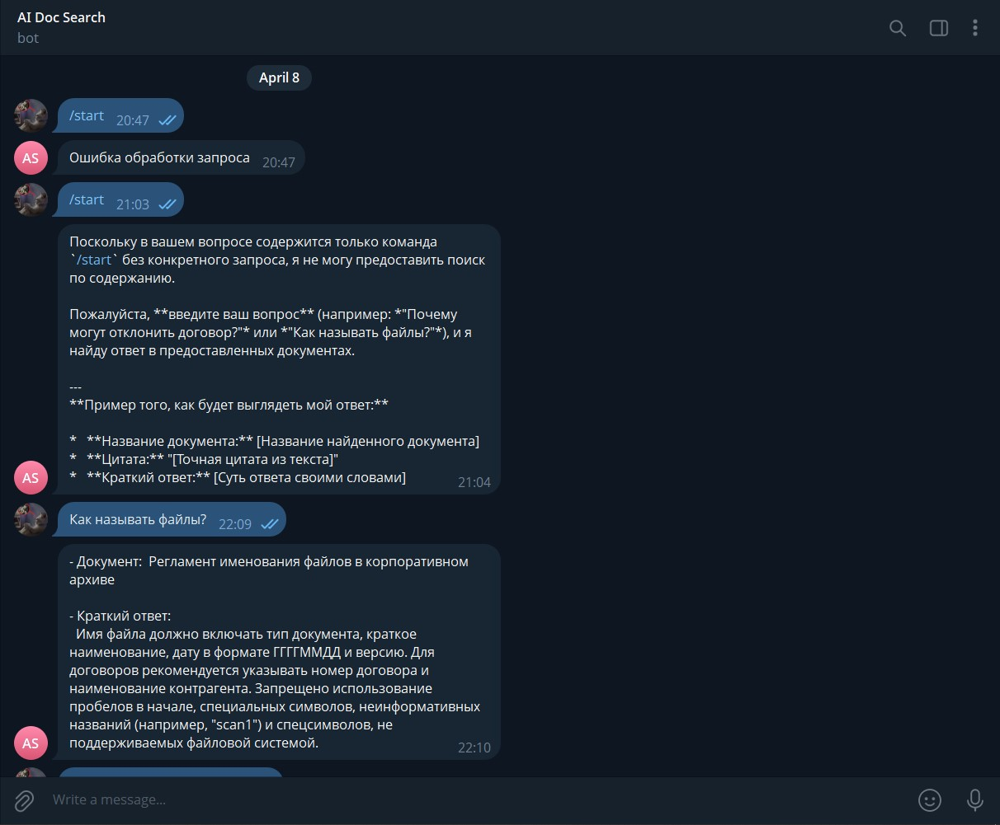
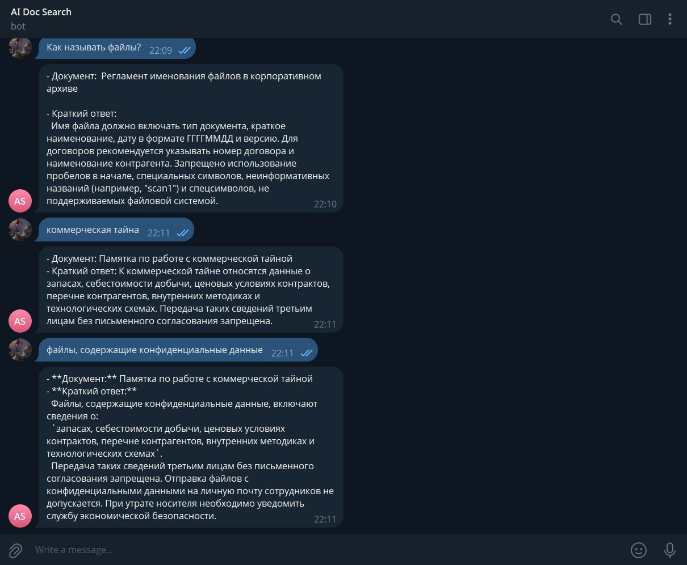

# AI Document Search Assistant

Телеграм бот для семантического поиска по внутренним документам компании.





## Запуск (Windows)

1. Клонируйте репозиторий:
```bash
git clone <repository-url>
cd ai-doc-search
```

2. Создайте виртуальное окружение:
```bash
python -m venv .venv
```

3. Активируйте виртуальное окружение:
```bash
.venv\Scripts\activate
```

4. Установите зависимости:
```bash
pip install -r requirements.txt
```

5. Создайте файл `.env` на основе `.env.example` и заполните его:
```
DATA_PATH=./data/synthetic_data.json
BOT_TOKEN=bot_token
OPENROUTER_API_KEY=api_key
LLM_MODEL_NAME=openrouter/free
EMBEDDING_MODEL_NAME=Qwen/Qwen3-Embedding-0.6B
USE_PROXY=true
PROXY_URL=http://127.0.0.1:port
```

6. Запустите бота:
```bash
python -m src.start
```

Или используйте готовый `.bat` файл:
```bash
start.bat
```
